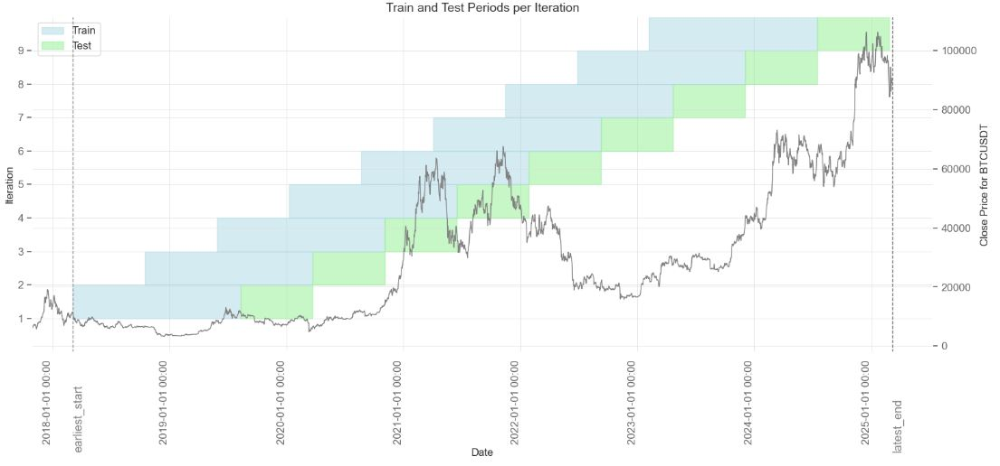
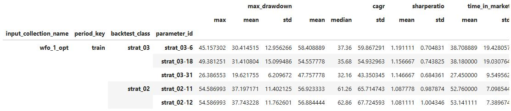

# 🧠 backtrader_manager
Manage large-scale otimizations using Backtrader, including walk-forward optimization  

[](mailto:Philipp.H.Schindler@gmail.com)  

## 📊 GitHub Discussions  
**Have questions or ideas?** Join the conversation in our [Discussions](https://github.com/PhilippHSchindler/backtrader_manager) section!  

---

## 🚧 Project Status

**Stage:** `Pre-Alpha` — Very early and experimental. Interfaces and internal structure may change significantly.  
Feedback and contributions are welcome!

| Status     | Meaning                             |
|------------|-------------------------------------|
| Pre-alpha  | Very early, experimental            |
| Alpha      | Core features exist, unstable       |
| Beta       | Mostly stable, needs testing        |
| Stable     | Ready for production use            |
| Maintenance| No new features, only fixes         |

---

## 📌 Description / Motivation

**`backtrader_manager`** helps you automate and manage large-scale backtests using [Backtrader](https://www.backtrader.com/).  
It handles walk-forward optimization, parameter tracking, and benchmark comparisons — all while keeping your setup clean and reproducible.

---

## ✨ Current Features

- ✅ Walk-forward optimization
- ✅ Reports via `quantstats`
- ✅ Strategy parameter tracking with `parameter_id` mapping
- ✅ Benchmark backtest integration

---

## 🔭 Planned Features / further development

- ⏳ 
- ...

[Check out my plan for further development, new features](road_map_development.md)

---

## 📦 Installation

clone and install in editable mode for development:

```bash
git clone https://github.com/PhilippHSchindler/backtrader_manager
cd backtrader_manager
pip install -e 
```

---

## 🚀 Quickstart / Usage Example


👉 [Check out the quickstart guide notebook](samples/BitcoinStrategies/quickstart_guide.ipynb) 

some screenshots:





---

## 🔖 Versioning

This project uses Semantic Versioning (SemVer) for versioning.
Versions are assigned using the format:

MAJOR.MINOR.PATCH

MAJOR version: Incremented when there are incompatible API changes or breaking changes.
MINOR version: Incremented when functionality is added in a backward-compatible manner.
PATCH version: Incremented for backward-compatible bug fixes or improvements.

Additionally, versions may include pre-release labels such as -alpha, -beta, or -rc to indicate the stability of the release.
